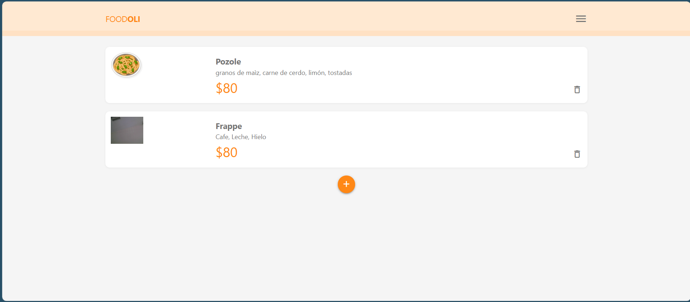
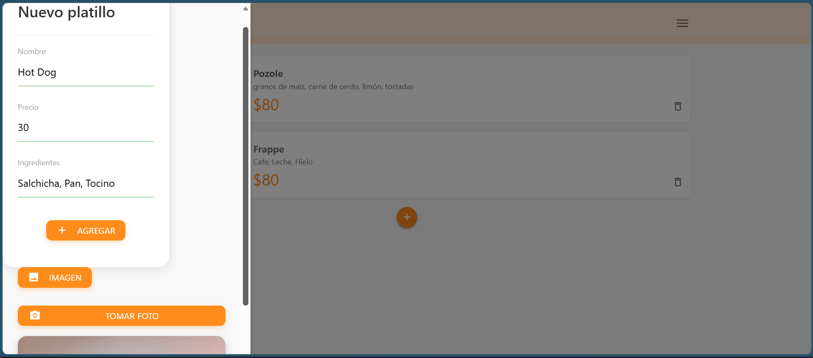
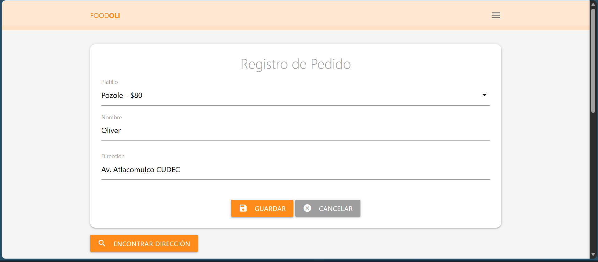
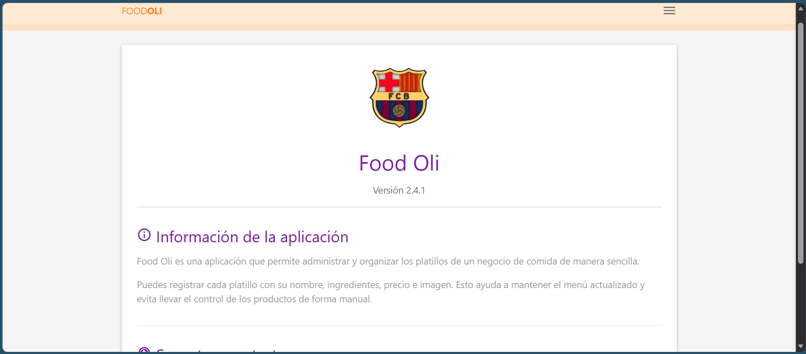
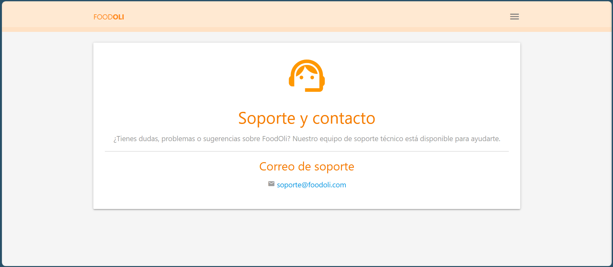

# FoodOli: Sistema de gestión de platillos y pedidos

**Tipo de aplicación:** Progressive Web App (PWA)  
**Materia:** Taller de Programación Avanzada II  
**Alumno:** Oliver Chagoya Tenorio  
**Grupo:** 09ISC182  
**Institución:** Universidad Multicultural CUDEC  
**Fecha:** 16/08/2026

## Descripción del Proyecto
FoodOli es una PWA para administrar platillos y pedidos de un negocio de comida. Permite registrar productos con nombre, precio ingredientes y fotografía.
Problema que resuelve
FoodOli evita llevar el control del menú y los pedidos de forma manual. Ayuda a organizar los platillos y facilita el registro de pedidos en los clientes

## Los usuarios principales son:
-Administradores o encargados del negocio de comida.

-Clientes que desean realizar un pedido.

-Personal que requiere consultar el menú digital.

## Objetivo General
Desarrollar una Progressive Web App para administrar platillos y pedidos de un negocio de comida, permitiendo registrar información, imágenes y datos de ubicación de forma sencilla.
Objetivos Específicos
-Registrar platillos con nombre, precio, ingredientes e imagen.
-Mostrar los platillos disponibles en un menú digital.
-Permitir la eliminación de platillos.
-Registrar pedidos realizados por los usuarios.
-Obtener la ubicación del usuario para agregar la dirección del pedido.
-Generar un código QR con el nombre del platillo seleccionado.
-Implementar una interfaz adaptable para dispositivos móviles.
-Permitir la instalación de la aplicación como PWA.

## Características principales

- Menú principal con los platillos registrados.
- Registro de nuevos platillos.
- Captura de fotografía desde la cámara.
- Almacenamiento de imágenes en formato Base64.
- Registro de nombre, precio e ingredientes.
- Eliminación de platillos.
- Formulario para registrar pedidos.
- Selección del platillo para realizar un pedido.
- Obtención de ubicación mediante geolocalización.
- Visualización de la ubicación mediante un mapa.
- Generación de código QR.
- Página Acerca de y Contacto.
- Funcionamiento como PWA.

## Tecnologías utilizadas

| Tecnología | Uso en el proyecto |
|---|---|
| HTML5 | Estructura de las páginas |
| CSS3 | Diseño y estilos |
| JavaScript ES6 | Lógica de la aplicación |
| Materialize CSS | Componentes visuales |
| Firebase 6.0.1 | Servicios en la nube |
| Cloud Firestore | Base de datos |
| Leaflet 1.9.4 | Visualización de mapas |
| QRCode.js | Generación de códigos QR |
| Service Worker | Funcionamiento PWA |

## Estructura del proyecto

FoodOli/

- css/
  - materialize.min.css
  - styles.css
- iconos/
  - icon-16x16.png
  - icon-64x64.png
  - icon-192x192.png
  - icon-512x512.png
- img/
  - dish.png
  - Inicio.png
  - Registrar_Platillo.png
  - Registrar_Pedido.png
  - Acerca.png
  - Contacto.png
- js/
  - db.js
  - firebase.js
  - index.js
  - materialize.min.js
  - pedidos.js
  - qrcode.min.js
- pages/
  - about.html
  - contact.html
  - pedidos.html
- index.html
- manifest.json
- sw.js

## Evidencias

### Inicio

**Descripción:** Pantalla principal de FoodOli donde se muestran las opciones disponibles para navegar por la aplicación y consultar los platillos registrados.

### Registrar platillo

**Descripción:** Formulario utilizado para registrar un nuevo platillo, ingresando su nombre, precio, ingredientes y fotografía.

### Realizar pedido

**Descripción:** Pantalla donde el usuario puede seleccionar un platillo, registrar la información del pedido y obtener la ubicación para realizar la entrega.

### Acerca de

**Descripción:** Página que presenta información general sobre FoodOli, explicando el propósito y las características principales de la aplicación.

### Contacto

**Descripción:** Página destinada a mostrar información de contacto para que los usuarios puedan comunicarse con los responsables de FoodOli.

## Bases de Datos 

Motor Utilizado: Cloud Firestore de Firebase.

La base de datos utiliza colecciones NoSQL para almacenar la informacion de la aplicacion.

## Coleccion: Platillos 

Almacena los datos de cada producto del menu. 

| Campo | Descripción |
|---|---|
| `nombre` | Nombre del platillo |
| `precio` | Precio del platillo |
| `ingredientes` | Ingredientes del platillo |
| `imagen` | Fotografía del platillo en Base64 |

## Coleccion: Pedidos 

Almacena los pedidos realizados por los usuarios.

| Campo | Descripción |
|---|---|
| `platillo` | Identificador del platillo seleccionado |
| `nombrePlatillo` | Nombre del platillo solicitado |
| `nombre` | Nombre del cliente |
| `direccion` | Dirección o ubicación del cliente |

## Licencia 

Este proyecto se distribuye bajo la licencia Creative Commons Atribución-NoComercial 4.0 Internacional (CC BY-NC 4.0). Esta licencia permite compartir y adaptar el material siempre que se otorgue atribución y no se use con fines comerciales.